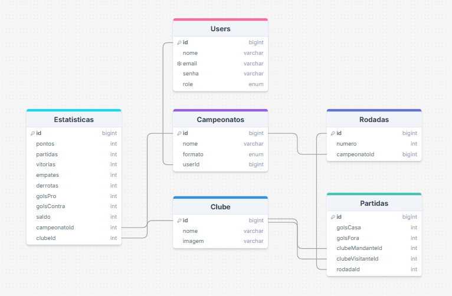

# CampSim


Uma aplicação web com o intuito de criar campeonatos personalizados e simular campeonatos existentes.

>_💻 Status do projeto: Em desenvolvimento._

## Resumo
O CampSim é uma aplicação web que permite a **criação de tabelas de campeonatos fictícias** e a **simulação de tabelas de campeonatos** já existentes.

## Tecnologias
[]([https://skillicons.dev](https://skillicons.dev))

<!-- 


## Instalação
## Uso

## API - Swagger

## Versionamento
-->

## Organização de Diretórios e Arquivos

### Backend

```
prisma/
├── schema.prisma    // Definição dos modelos de dados e configurações do Prisma
└── seed.ts          // Script para povoar o banco com dados iniciais (seed)
src/
├── __tests__/      
├── config/          // Configurações globais (Prisma client, dotenv, etc)
├── constants/       
├── controllers/     // Camada responsável por receber as requisições e responder ao cliente
├── middleware/      // Middlewares Express (Autenticação, validação de request, etc)
├── repositories/    // Camada de acesso ao banco de dados
├── routes/          // Definição e organização das rotas da aplicação
├── schemas/
├── services/        // Regras de negócio e validações
├── types/           // Tipagens compartilhadas (DTOs, enums, etc)
├── utils/
├── app.ts           // Instancia o app Express, aplica middlewares e rotas
└── server.ts        // Inicializa o servidor e conecta ao banco de dados
```

### Banco de Dados

A estrutura do banco de dados seguiu o seguinte modelo:



## Metas
- [X] Definir e modelar o banco de dados com Prisma
- [X] Criar seeders iniciais
- [X] Implementar autenticação com JWT e bcrypt
- [X] Desenvolver os módulos da aplicação
- [X] Criar validações de entrada
- [X] Implementar a estrutura de repositório, service e controller
- [X] Criar rotas RESTful para cada entidade
- [X] Proteger rotas com autenticação
- [X] Configurar tratamento global de erros
- [ ] Adicionar testes unitários
- [ ] Documentar principais rotas e respostas com swagger
